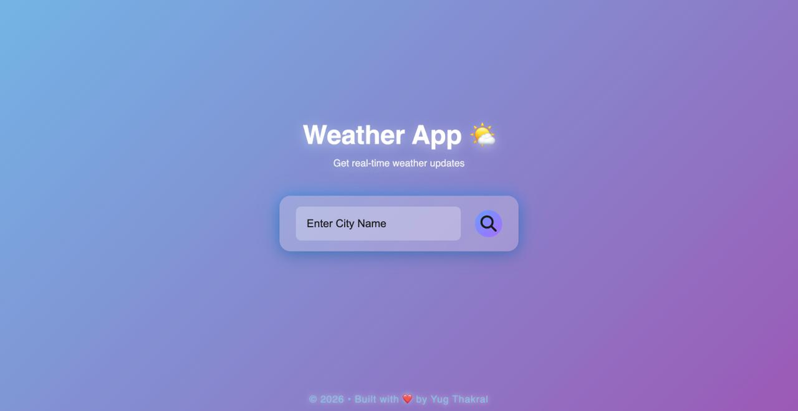
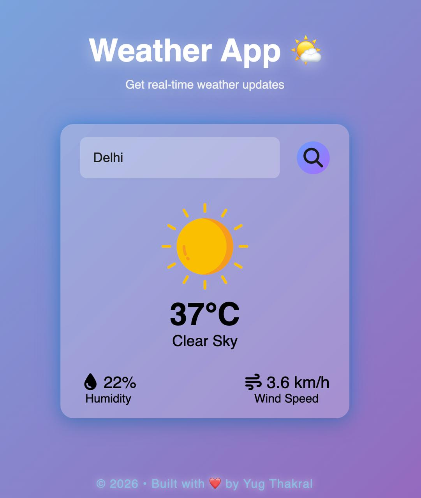
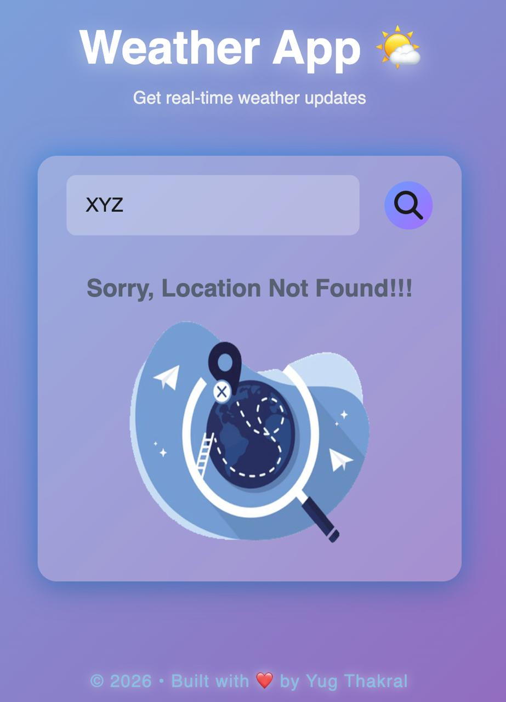

# 🌤️ Weather App (Live API Based)

A modern and responsive weather application built using **HTML, CSS, and JavaScript**, powered by a **real-time weather API**.

This project focuses on clean UI design, smooth user experience, and fetching live weather data dynamically.

---

## 📸 Preview  

  
  
  

---

## 🚀 Features  
- 🌍 Search weather by city name  
- 🌡️ Real-time temperature updates  
- ☁️ Dynamic weather conditions (Clouds, Rain, Haze, etc.)  
- 💧 Humidity information  
- 💨 Wind speed display  
- 🎨 Modern glassmorphism UI with glow effects  
- ⚡ Fast and responsive design  
- ❌ Error handling for invalid locations  
- 🔄 Auto UI update on search  

---

## 🔗 API Integration (Highlight 🔥)  
This project uses the **OpenWeatherMap API** to fetch live weather data.

- ✔ Real-time data fetching using `fetch()`  
- ✔ JSON parsing and dynamic DOM updates  
- ✔ API-based weather icons & conditions  
- ✔ Handles API errors (404, invalid city)  

---

## 🛠️ Tech Stack  
- HTML5  
- CSS3 (Flexbox, Glassmorphism, Animations)  
- JavaScript (Async/Await, Fetch API, DOM Manipulation)  
- OpenWeatherMap API 🌐  

---

## 📂 Project Structure  
Weather-App/
│── images/
│── index.html
│── style.css
│── script.js

---

## 💡 About the Project  
This Weather App was created by **Yug Thakral** to practice web development concepts and API integration.

It demonstrates how to:
- Work with real-world APIs 🌐  
- Handle asynchronous JavaScript  
- Build responsive and modern UI  

---

## 👨‍💻 Contributor  
**Yug Thakral**

---

## 🤝 Connect With Me  

  

